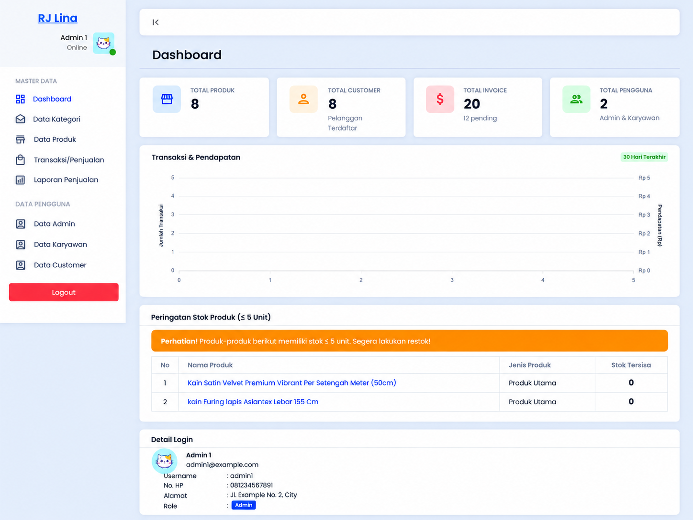
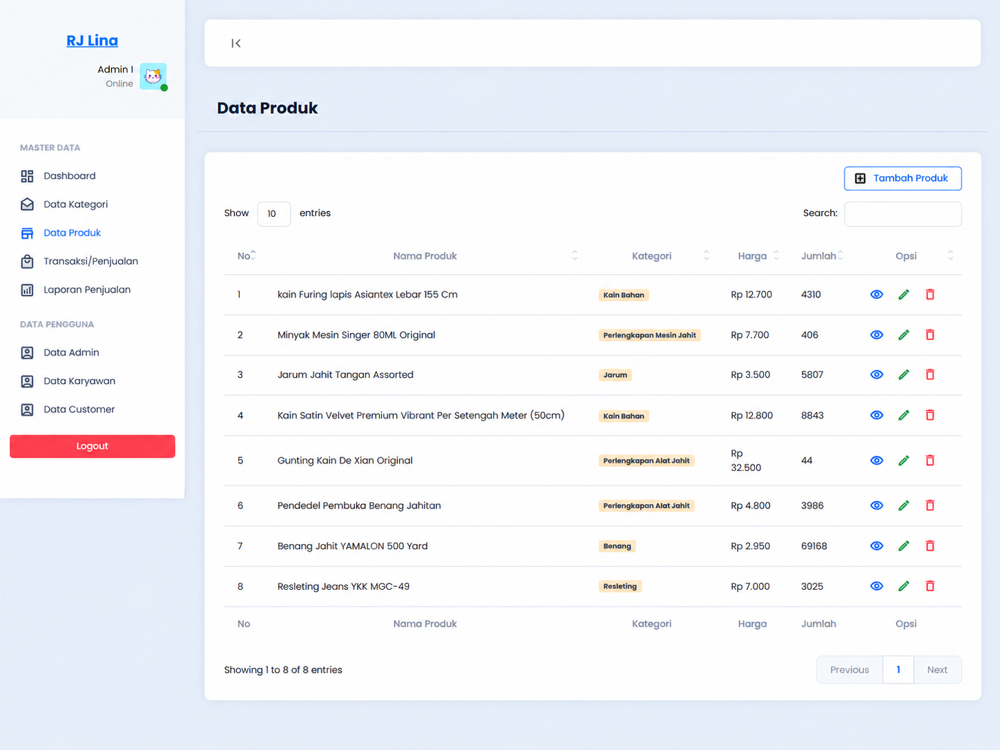
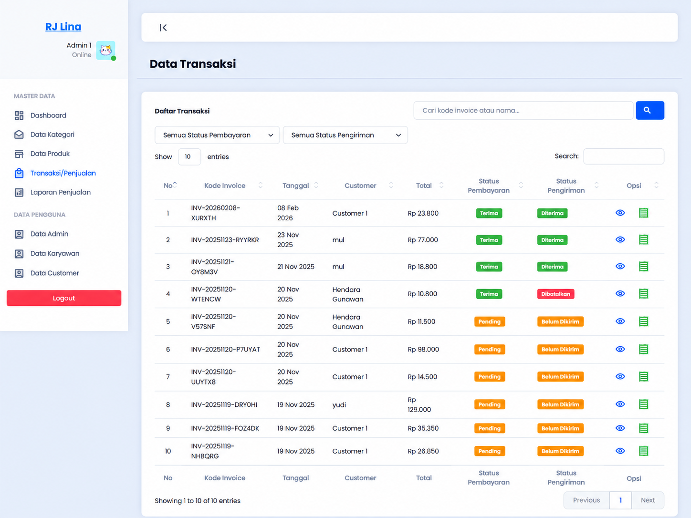
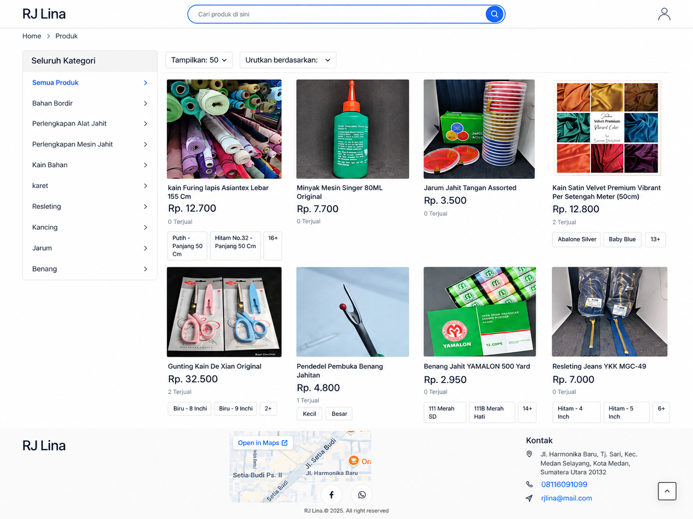
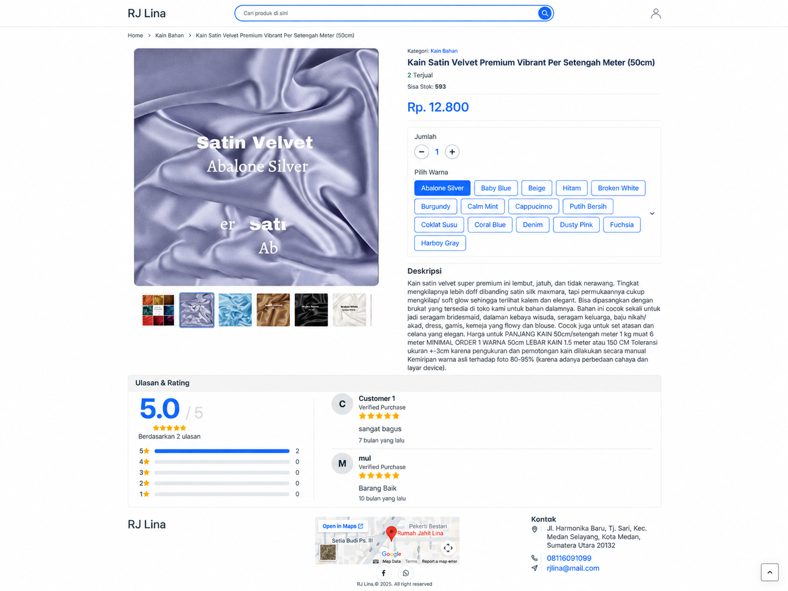
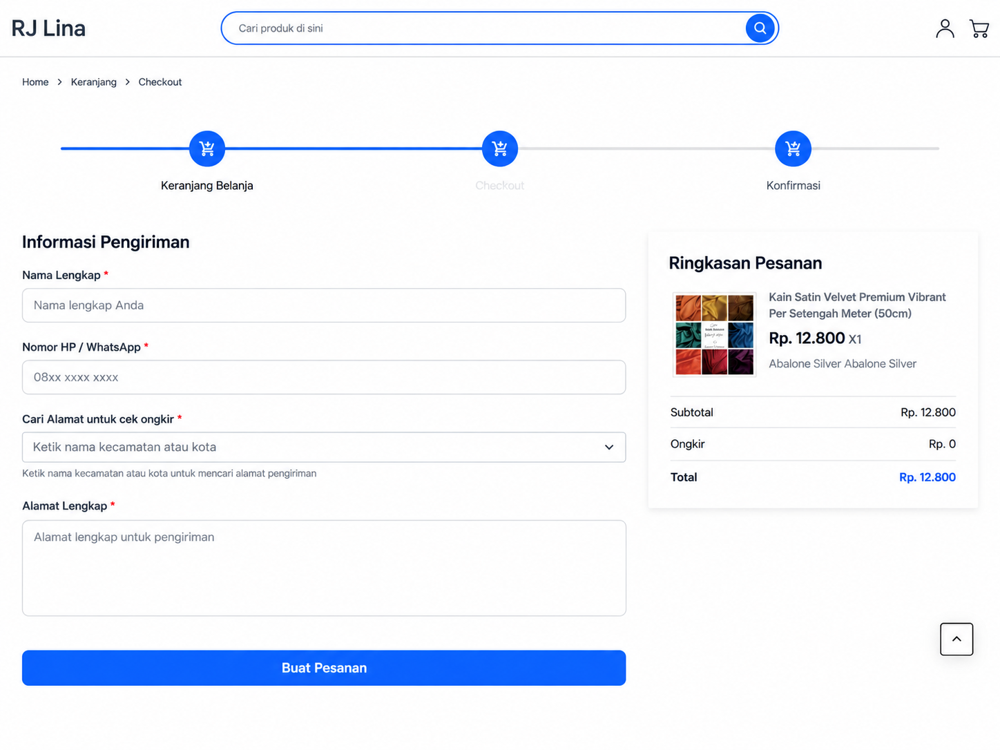
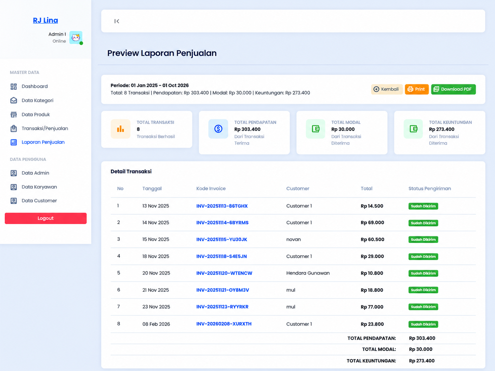
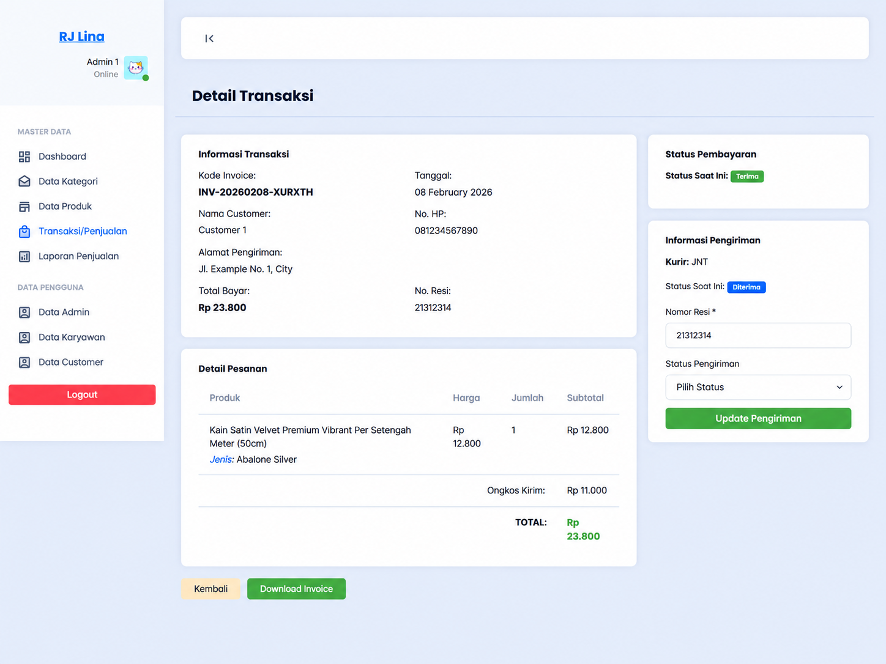
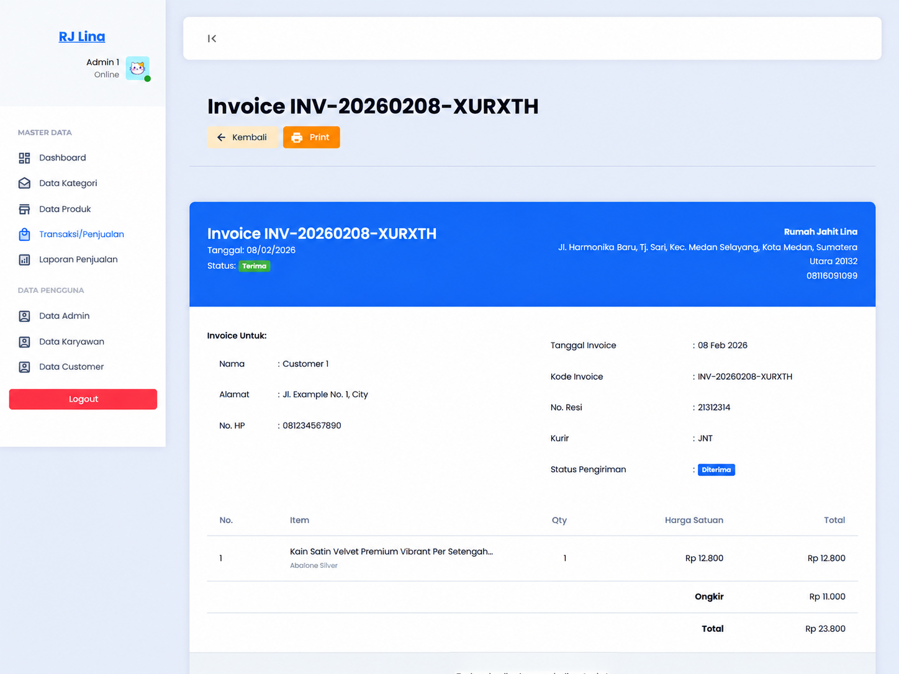

# Rumah Jahit Lina Sales Information System

**Web-based Sales, Inventory, Transaction, and Reporting System**

Bachelor's thesis project by **Muliadi**  
Information Systems, Faculty of Computer Science  
Universitas Katolik Santo Thomas

> **Portfolio repository:** Sensitive credentials, private customer data, runtime uploads, production database records, and third-party UI assets without clear redistribution permission are intentionally excluded from this public repository.

## Project Overview

Rumah Jahit Lina Sales Information System is a web application developed to digitize sales and inventory workflows for a sewing-supply business. The system centralizes product management, stock monitoring, customer transactions, shipping, invoices, payments, reporting, and user management in one application.

The application supports three main roles:

| Role | Main Access |
| --- | --- |
| **Admin** | Dashboard, products, categories, transactions, reports, admin/employee/customer management |
| **Employee** | Dashboard, products, categories, transactions, reports |
| **Customer** | Product browsing, cart, checkout, orders, shipping information, ratings and reviews |

## Project Preview

### Admin Dashboard

<table>
<tr>
<td width="50%">

**Product Management**

</td>
<td width="50%">

**Transaction Management**

</td>
</tr>
<tr>
<td width="50%">

**Product Catalog**

</td>
<td width="50%">

**Product Detail and Reviews**

</td>
</tr>
<tr>
<td width="50%">

**Checkout**

</td>
<td width="50%">

**Sales Report**

</td>
</tr>
</table>

### Transaction Detail and Invoice

<table>
<tr>
<td width="50%">

</td>
<td width="50%">

</td>
</tr>
</table>

## Main Features

- Authentication and password reset
- Role-based access for Admin, Employee, and Customer
- Product and category management
- Product variants and product image management
- Inventory and stock-history tracking
- Low-stock monitoring on the admin dashboard
- Shopping cart and checkout workflow
- Shipping cost integration
- Midtrans payment integration
- Transaction and invoice management
- Shipping status and tracking-number management
- Customer, employee, and admin management
- Sales reports with revenue, cost, and profit summaries
- PDF report and invoice output
- Product ratings and reviews

## Security and Portfolio Hardening

Before publication as a public portfolio repository, the project was cleaned and hardened to reduce exposure of sensitive data and improve access control.

- Role-based middleware protects Admin, Employee, and Customer routes
- Customer-owned order and invoice access is restricted by authenticated user
- Product prices and transaction totals are validated from server-side data
- Payment amounts are not trusted from browser-submitted values
- External service credentials are stored through environment variables
- Real .env files, uploads, database dumps, logs, caches, vendor, and node_modules are excluded from Git
- Composer dependency audit completed without known security advisories at publication time
- npm dependency audit completed without known vulnerabilities at publication time

## Tech Stack

### Backend

- PHP 8.2+
- Laravel 12
- MySQL
- Eloquent ORM
- Laravel Blade
- Pest / Laravel testing tools

### Frontend

- HTML
- CSS
- JavaScript
- Tailwind CSS 4
- Vite 7
- Sass

### Integrations

- Midtrans PHP SDK
- RajaOngkir / shipping-cost API integration

## Development Method

The system was developed using the **Waterfall** method as part of the thesis:

> **Sistem Informasi Penjualan pada Rumah Jahit Lina Berbasis Web Menggunakan Metode Waterfall**

The development process covered requirements analysis, system design, implementation, testing, deployment, and maintenance planning.

## Testing

The academic thesis documented **22 Black Box testing scenarios**, with all 22 scenarios recorded as successful.

The public repository also includes basic automated Laravel tests. Before publication, the current project passed:

    Tests: 2 passed
    Production build: successful

These automated tests are a basic baseline and do not replace the broader functional testing documented in the thesis.

## Demo Accounts

The database seeder creates local demonstration accounts:

| Role | Username | Password |
| --- | --- | --- |
| Admin | admin1 | password123 |
| Employee | karyawan1 | password123 |
| Customer | customer1 | password123 |

> These credentials are dummy accounts intended only for local development and portfolio demonstration.

## Local Setup

### Requirements

- PHP 8.2+
- Composer
- MySQL
- Node.js and npm

Clone the repository:

    git clone https://github.com/Muly-Adi/rumah-jahit-lina-sales-system.git
    cd rumah-jahit-lina-sales-system

Install dependencies:

    composer install
    npm install

Create the local environment file:

    cp .env.example .env
    php artisan key:generate

Configure your local MySQL database in .env, then run:

    php artisan migrate --seed
    npm run build
    php artisan serve

For development:

    npm run dev

## External Service Configuration

Real credentials are never stored in this repository.

    MIDTRANS_SERVERKEY=
    MIDTRANS_CLIENTKEY=
    MIDTRANS_IS_PRODUCTION=false

    RAJAONGKIR_API_KEY=
    RAJAONGKIR_ORIGIN_DISTRICT=

Use your own authorized sandbox/development credentials when testing external integrations.

## Public Repository Notes

The original local application used additional interface assets during academic development. Some third-party UI assets are intentionally excluded from this public repository because their redistribution rights were not sufficiently clear.

The screenshots above show the original working interface, while this repository focuses on the project-specific application logic, Laravel structure, database migrations, controllers, models, routes, views, and security improvements.

## Privacy and Data

The original academic database contained development and transaction records. Those records are not published here.

This portfolio version uses:

- Database migrations
- Seeder-generated dummy users
- Placeholder contact information
- No production credentials
- No real customer uploads
- No original database dump

## Academic Context

- **Developer:** Muliadi
- **Program:** Bachelor of Information Systems
- **Faculty:** Faculty of Computer Science
- **University:** Universitas Katolik Santo Thomas
- **Project Type:** Bachelor's Thesis / Academic Portfolio Project

## Repository Structure

    app/                Application controllers, middleware, models, notifications
    config/             Laravel configuration
    database/           Migrations, factories, and seeders
    docs/screenshots/   Portfolio screenshots
    resources/          Blade views, CSS, JavaScript, language files
    routes/             Web and console routes
    tests/              Automated tests

## License

No open-source license is granted for the project-specific source code in this repository.

Third-party packages and libraries remain subject to their respective licenses.
